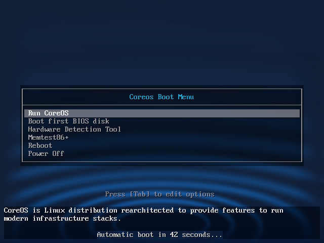

coreos-usb-creator
==================



This is a small utility to create Coreos images ready to boot from a USB device
or from a CD. In the first case, it will create a image with a FAT32 filesystem
with all the required components inside (syslinux, coreos, ...) and a
[*cloud-config.yml*](https://coreos.com/docs/cluster-management/setup/cloudinit-cloud-config) which you can edit and change to setup the Coreos
configuration.

Default is create a ISO image which can be dumped to a USB device or burned on a
CD, but, in this case, you will not be able to edit the configuration file
*cloud-config.yml*. If you want to change as many times you want the configuration
without rebuild the image, use the `--usb` parameter, but in this case the image
is only valid for USB devices, not to burn on CDs.


This script was tested on Ubuntu Trusty (14.04) but it should work on
other Linux distributions .


```shell
# ./mkimg.sh --help
Usage:

    mkimg.sh  [<arguments>]

Coreos image builder (hybrid ISO and FAT32 image) for Linux using syslinux
IMG: editable FAT32 ready to dump to a USB drive
ISO: hybrid ISO (image and USB) ready to dump or burn

Arguments:

   -a, --autologin          Enable coreos.autologin boot parameter
   -h, --help               Show this usage message
   -c, --cloudconfig <cloud-config>       Cloud-config file for cloud-config
   -k, --sshkey <file>      ssh-key file to include automatically via boot cmd
   -o, --output <file>      Output image file (coreos-current.iso)
   -i, --autoinstall <cloud-config>       Cloud-config to automatic install
   -s, --size <#>           Size in MB (1000)
   -v, --coreosversion <version>          Coreos version (current)
   -l, --coreoschannel <channel>          Choose from [alpha, beta, stable]
   -u, --usb                Create an IMG file to dump to USB (ISO hybrid)
       --oemcloudconfig <cloud-config>    Static basic cloud-config for OEM
       --cloudconfigurl <url>             URL for cloud-config via boot cmd

Note: a cloud-config file can be a bash script file. See cloud-init docs.

```


Usage
-----

First of all, the script depends on some programs, make sure you have installed
those:

* wget
* gzip
* dd
* 32-bit support (to run commands from syslinux release)
* mkisofs


To create USB images:

* sudo (to access to loop devices and create filesystems)
* parted (to create partitions on the loop device)
* extlinux*
* losetup (to control loop devices)


If extlinux and isohybrid commands are not found in the system, the script will
try to use equivalent ones precompiled in the syslinux release, but in order
to run those, you will need to have installed 32-bit support
(`sudo apt install libc6:i386 libuuid1:i386` or yum -y `install glibc.i686`)
on the system. See https://github.com/jriguera/coreos-usb-creator/issues/1


The program will download *syslinux*, *memtest*, *pci.ids* and the Coreos
kernel and ramdisk from their websites, so a connection to the Internet 
is required.

To create an hybrid ISO image (for USB and CD), just type:

```shell
# ./mkimg.sh
-> Creating /tmp/coreos-usb-creator/coreos-current_20646 ...
-> Copying syslinux files and modules ...
-> Downloading memtest86+-5.01.bin.gz : done
-> Downloading pci.ids definition file for hdt : done
-> Creating default syslinux.cfg configuration file ...
-> Downloading CoreOS's kernel ...
-> http://stable.release.core-os.net/amd64-usr/current/coreos_production_pxe.vmlinuz: done
-> Downloading CoreOS's initrd ...
-> http://stable.release.core-os.net/amd64-usr/current/coreos_production_pxe_image.cpio.gz: done
-> Integrating OEM config /tmp/coreos-usb-creator/oem-config.yml ... done
-> Copying live configuration files ...
-> Creating main syslinux.cfg file ...
-> Making hybrid ISO image coreos-current.iso ... done
-> Removing temporary folder coreos-current_20646 ...
```

Plus Coreos kernel and initrd, the following files will be used/included:

 * `cloud-config.yml` is the default Cloud-config file ready to be edited for
 the user.
 * `oem-config.yml` is the file which makes possible for Coreos to read the
 previous configuration. You should not modify this file.
 * `splash.png` as background image for syslinux (remove/change it if you want).


 But, if you want to create an USB image with a FAT32 filesystem to be able
 to change the configuration as many times you want, use `-u` or `--usb`. In this case, the script will stop asking you for sudo permissions in order to
 operate with loop devices:


 ```shell
# ./mkimg.sh -u
-> Creating /tmp/coreos-usb-creator/coreos-current_21301 ...
-> WARNING: You will need sudo permissions to operate with a loop device ...
-> Creating base image /tmp/coreos-usb-creator/coreos-current.img with dd ...
-> Associating /tmp/coreos-usb-creator/coreos-current.img with a loop device ...
[sudo] password for jriguera:
-> Creating partitions on /dev/loop2 ...
-> Writing syslinux MBR on /dev/loop2 ...
-> Creating FAT partition and fs on /dev/loop2 ...
-> Mounting /dev/loop2p1 on coreos-current_21301 ...
-> Installing syslinux (extlinux) ...
-> Copying syslinux files and modules ...
-> Downloading memtest86+-5.01.bin.gz : done
-> Downloading pci.ids definition file for hdt : done
-> Creating default syslinux.cfg configuration file ...
-> Downloading CoreOS's kernel ...
-> http://stable.release.core-os.net/amd64-usr/current/coreos_production_pxe.vmlinuz: done
-> Downloading CoreOS's initrd ...
-> http://stable.release.core-os.net/amd64-usr/current/coreos_production_pxe_image.cpio.gz: done
-> Integrating OEM config /tmp/coreos-usb-creator/oem-config.yml ... done
-> Copying live configuration files ...
-> Creating main syslinux.cfg file ...
-> Umounting temporary mountpoint coreos-current_21301 ...
-> Disassociating /tmp/coreos-usb-creator/coreos-current.img with the loop device /dev/loop3 ...
-> Removing temporary folder coreos-current_21301 ...

 ```

 Now you can dump the generated file `coreos-current.img` to you USB device.
 **WARNING: this operation will overwrite all the data in the device, please
 pay attention to which device you want write to**. As a suggestion, to
discover the device, you can do:

```shell
# Insert you USB key
$ dmesg | tail
[341477.117746] sr 12:0:0:1: Attached scsi CD-ROM sr1
[341477.117834] sr 12:0:0:1: Attached scsi generic sg7 type 5
[341477.118586] sd 12:0:0:0: [sdf] No Caching mode page found
[341477.118591] sd 12:0:0:0: [sdf] Assuming drive cache: write through
[341477.125472] sd 12:0:0:0: [sdf] No Caching mode page found
[341477.125479] sd 12:0:0:0: [sdf] Assuming drive cache: write through
[341477.134622]  sdf: sdf1
[341477.138709] sd 12:0:0:0: [sdf] No Caching mode page found
[341477.138714] sd 12:0:0:0: [sdf] Assuming drive cache: write through
[341477.138718] sd 12:0:0:0: [sdf] Attached SCSI removable disk
# Probably is device sdf
# See if it was mounted, if so, umount it
$ mount | grep sdf
/dev/sdf1 on /media/jriguera/VOL type vfat (rw,nosuid,nodev,uid=1000,gid=1000,shortname=mixed,dmask=0077,utf8=1,showexec,flush,uhelper=udisks2)
$ sudo umount /dev/sdf1
# Dump the image to the USB device
$ sudo dd if=coreos-current.img of=/dev/sdf bs=1024
1024000+0 registros leídos
1024000+0 registros escritos
1048576000 bytes (1,0 GB) copiados, 116,91 s, 9,0 MB/s
$ sync
```

 Other interesting functionality is the creation of autoinstalable USB/CD
 devices. **WARNING: be careful testing this functionality, you can easily
 destroy the data of your computer if you boot accidentally with the USB**.
 Let's see how to create an USB image from Coreos beta channel and autoinstalable:

 ```shell
 ./mkimg.sh --coreoschannel beta --usb --autoinstall install.sh
-> Creating /tmp/coreos-usb-creator/coreos-current_21899 ...
-> WARNING: You will need sudo permissions to operate with a loop device ...
-> Creating base image /tmp/coreos-usb-creator/coreos-current.img with dd ...
-> Associating /tmp/coreos-usb-creator/coreos-current.img with a loop device ...
[sudo] password for jriguera:
-> Creating partitions on /dev/loop4 ...
-> Writing syslinux MBR on /dev/loop4 ...
-> Creating FAT partition and fs on /dev/loop4 ...
-> Mounting /dev/loop4p1 on coreos-current_21899 ...
-> Installing syslinux (extlinux) ...
-> Copying syslinux files and modules ...
-> Downloading memtest86+-5.01.bin.gz : done
-> Downloading pci.ids definition file for hdt : done
-> Creating default syslinux.cfg configuration file ...
-> Downloading CoreOS's kernel ...
-> http://beta.release.core-os.net/amd64-usr/current/coreos_production_pxe.vmlinuz: done
-> Downloading CoreOS's initrd ...
-> http://beta.release.core-os.net/amd64-usr/current/coreos_production_pxe_image.cpio.gz: done
-> Integrating OEM config /tmp/coreos-usb-creator/oem-config.yml ... done
-> Copying live configuration files ...
-> Creating main syslinux.cfg file ...
-> Umounting temporary mountpoint coreos-current_21899 ...
-> Disassociating /tmp/coreos-usb-creator/coreos-current.img with the loop device /dev/loop5 ...
-> Removing temporary folder coreos-current_21899 ...

-> WARNING this image is like a virus!. Be careful, it is autoinstalable!

 ```

Have a look (and edit if it is necessary) the script `install.sh` if you want
to change how it works, also, it is included in USB, so you can edit it
from the FAT filesystem.


Hacking
-------

For hacking and change the default values (versions, URLs, ...) of the script have a look at the code.


Author
------

Jose Riguera Lopez <jriguera@gmail.com>
